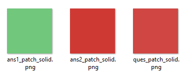
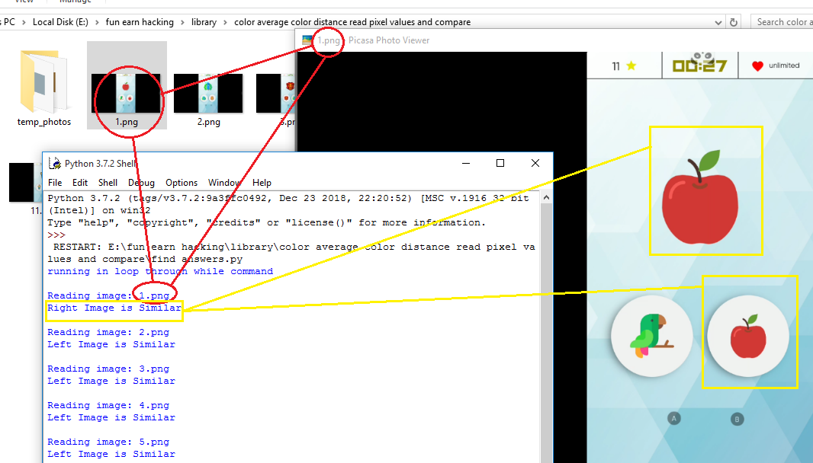
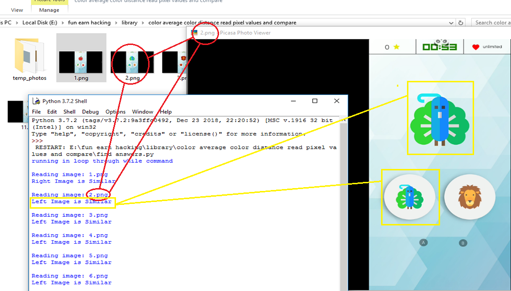

# Comapare images using their Dominant Color
This repository is all about finding the dominant colors in images and comparing them using python.
# Working Flow
>Read image for eg., `1.png` from current directory
 ```python
 from PIL import Image
original_screenshot = Image.open(str(run_status)+".png")
 ```


>Crop out particular area from the image
 ```python
import PIL
box_area1 = (639,204, 730, 290)
box_area2 = (578,464, 623, 506)
box_area3 = (744,467, 789, 509)

ques = original_screenshot.crop(box_area1)
ans1 = original_screenshot.crop(box_area2)
ans2 = original_screenshot.crop(box_area3)
 ```


>After cropping the `box_area1`, `box_area2` and `box_area3` we will find the average color of that area
```python
img = cv2.imread(cropped_area.png)
height, width, _ = np.shape(img)

# calculate the average color of each row of our image
avg_color_per_row = np.average(img, axis=0)

# calculate the averages of our rows
avg_colors = np.average(avg_color_per_row, axis=0)

# avg_color is a tuple in BGR order of the average colors
# but as float values
#print(f'avg_colors: {avg_colors}')
# so, convert that array to integers
int_averages = np.array(avg_colors, dtype=np.uint8)

# create a new image of 100x100 pixels
# and fill its pixels with our average color
average_image = np.zeros((100, 100, 3), np.uint8)
average_image[:] = int_averages

# finally, save it as new image
cv2.imwrite('color_patch_solid.png", average_image)
```
>Saved `color_patch_solid.png` image


> So after we have got the average dominant colour from the images
>we can check for highest value of `R,G,B` from one of the images to be compared
>and look for that particular layer intensity values in other to images
>in order to compare the images.

```python
im = Image.open('color_patch_solid.png.png')
pixel = (2,2)
rgb = im.getpixel(pixel) #rgb variable stores the R,G,B values

#Now we will convert the array to a list to extract
#individual R,G,b values and use them to compare
rgb = list(im.getpixel(pixel) #rgb variable stores the R,G,B values)

a = int(rgb[0])
b = int(rgb[1])
c = int(rgb[2])

if (a >= b) and (a >= c): 
	largest = 'red' 
elif (b >= a) and (b >= c): 
	largest = 'green'
else: 
	largest = 'blue'
#so now our 'largest' variable had stored the max value out of three R,G,B channels
#hence we will use that channel to compare the other two image.
print(largest)
```

>so now we have got the channel which we will be using to compare the other two images
>and check which of the other two colours are similar to this colour
>here are all those three color patches


>so this was how the code works
>anyways let me show you a demo how i used this code to make my computer play the game.

>here we go!


>you can clearly see how it loads the image
>finds the dominant color, as i explained above
>and finally decides which one of the out of three channels R,G,B
>will be used to compare the image
```python
ques_layer = max_color(ques_color)
ans1_layer = max_color(ans1_color)
ans2_layer = max_color(ans2_color)

if ans1_layer == ques_layer :
	ans = 'Left Image is Similar'
else:
	ans = 'Right Image is Similar'
```

